# Keil Studio Cloud

# Contents
- [Keil Studio Cloud](#keil-studio-cloud)
- [Contents](#contents)
- [What is this?](#what-is-this)
- [Prerequisites](#prerequisites)
- [Getting Started](#getting-started)
  - [IDE](#ide)
    - [Select Your Board](#select-your-board)
    - [Create a New Project](#create-a-new-project)
  - [Flash an LED](#flash-an-led)
    - [Compile and Run](#compile-and-run)
  - [Debugging](#debugging)
    - [Breakpoints](#breakpoints)
    - [Starting a Debugging Session](#starting-a-debugging-session)
      - [Step Over](#step-over)
      - [Step Into](#step-into)
      - [Stopping the Debugger](#stopping-the-debugger)
    - [Variable Inspection](#variable-inspection)
    - [Memory Inspection](#memory-inspection)
    - [Register Inspection](#register-inspection)

# What is this?

Keil Studio Cloud is a web based IDE that allows for the creation, running and debugging of embedded applications. It runs ARM Mbed OS which is an open source operating system for microcontrollers. It is a great tool for beginners as it does not require any installation and is very easy to use.

# Prerequisites

To use Keil Studio Cloud you will need the following:
- Basic knowledge of C++
- Basic knowledge of embedded systems
- An internet connection
- A STM32L4R5ZI Nucleo board
- Optionally an understanding of the ARM Mbed OS
- Optionally an understanding of ARM assembly

Throughout this tutorial I will be using Google Chrome, however any modern browser should work.

# Getting Started

Getting started is extremely easy. Simply head to the [Mbed site](https://os.mbed.com/account/login/) and create a free account. Once you have done this, you will be able to access the Keil Studio Cloud IDE.

## IDE

To access the IDE follow this link: [Keil Studio Cloud](https://studio.keil.arm.com/auth/login/). It may ask you to log in again, use the account you just created to gain access. You will then be greeted with the following screen:

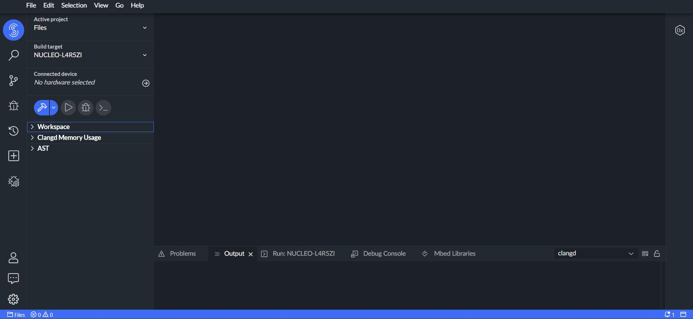

### Select Your Board

So that Keil Studio knows what libraries to use and what board to compile for, you will need to select your board.

1. Click Build Target selection.
2. Select your board from the list, in our case this will be `NUCLEO-L4R5ZI`.

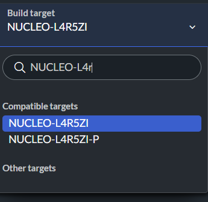

### Create a New Project

To create a new project simply go to `File` -> `New` -> `Mbed Project`. You will then be asked to name your project and select an example project to use. For this tutorial we will be using an empty project.

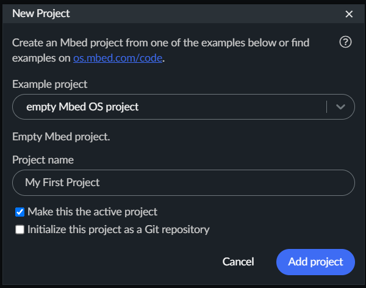

Ensure that the option `Make this the active project` is selected and click `Add Project`.

Creating the project can take some time depending on your internet connection. Once it has finished you will be able to see your project in the project explorer.

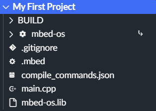

## Flash an LED

To check if our board is working correctly we will flash the blue on-board LED. To do this we will need to write some basic code.

1. Open the `main.cpp` file in the project explorer.
2. Above the `main` function add the following code:


    ```cpp
    DigitalOut blueLED(LED2);
    ```

3. In the `main` function, within the `while` loop, add the following code:

    ```cpp
    blueLED.write(!blueLED);
    ThisThread::sleep_for(500ms);
    ```

This is basic code to set up a pin to output, we then toggle the pin every 500ms. This will cause the LED to flash.

### Compile and Run

1. Connect your board to your computer using the appropriate USB cable. Ensure to use the USB port labelled `USB PWR`.

    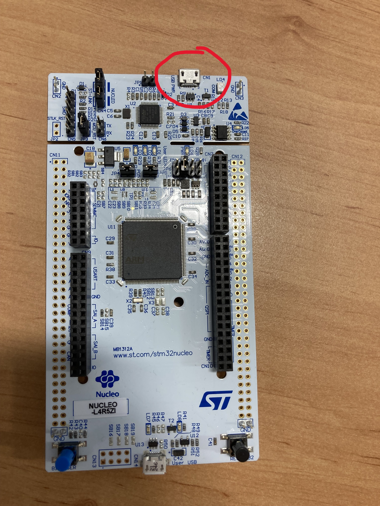

2. Now click on the `Connected Device` window.

    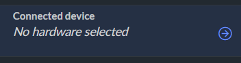

3. Now click on `Add Device`and select `STM32 STLink`.

    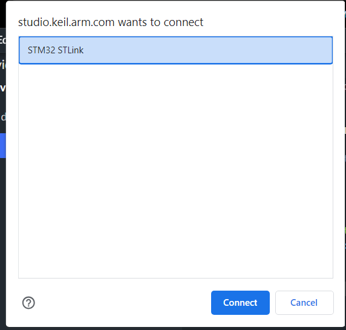

4. Return to the project explorer you should now see that your device is connected successfully.

    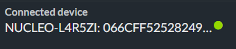

5. Now we can compile and run our code. Click on the `Run` button. This will build and flash our project onto the microcontroller. This process can take some time depending on your internet connection.

    

6. Once the code has been flashed onto the board, the LED should start flashing.

    

You have now successfully flashed your first program onto the board.

## Debugging

Keil Studio Cloud offers a good range of debugging capabilities. These include: breakpoints, variable inspection, memory inspection and register inspection.

### Breakpoints

To add a breakpoint to our code we simple need to click to the left of the line number we want to break at. A red dot should appear indicating that a breakpoint has been added. When our debugging reaches this point it will temporarily pause execution, allowing you to inspect the state of the program.

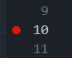

### Starting a Debugging Session

To start a debugging session simply click on the `Debug` button. This will build your project and flash it onto the board. Once the code has been flashed, the debugger will start and the code will begin running.


Building the project can take some time depending on your internet connection.

When the debugger starts you will be greeted with the following screen:

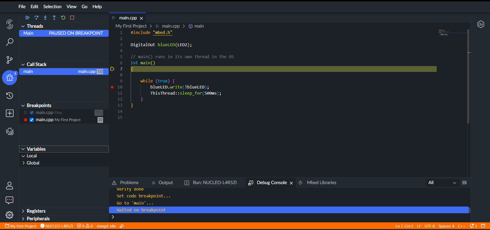

The debugger will automatically pause execution at the start of the `main` function. To proceed to the next breakpoint press the `Continue` button.


You can now see that the debugger has stopped execution at the next line.

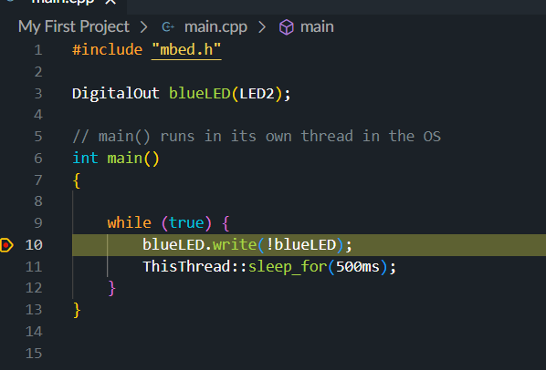

#### Step Over

The `Step Over` button will execute the next line of code and stop execution at the next line. If the line to run is a function call, the function will be executed and the debugger will stop at the next line after the function call.


#### Step Into

The `Step Into` button works in the same way as the `Step Over` button, however if the line to run is a function call, the debugger will move into that function and stop at the first line of that function.


In our case we will just `Step Over` to the next line. We will now see that the LED has been turned on. If we continue to `Step Over` we will see that the LED is turned off again.

#### Stopping the Debugger

To stop the debugger simply click on the `Stop` button. This will stop the debugger and return you to the code editor.


### Variable Inspection

To inspect the value of a variable you will first need to start a debugging session. When this is done you should be able to see a `Variables` window. If you cannot right click on any of the tabs in the debugging window and select `Variables`.

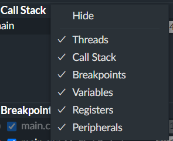

Below is what you will see:

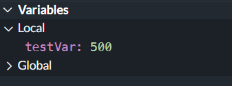

You can view local (variables in the current scope of the program) and global variables (variables in the global scope of the program).

### Memory Inspection

To inspect the memory of the microcontroller you will first need to start a debugging session. When this is done open the `Memory Inspector` window. This can be opened by going to `View` -> `Memory Inspector`.

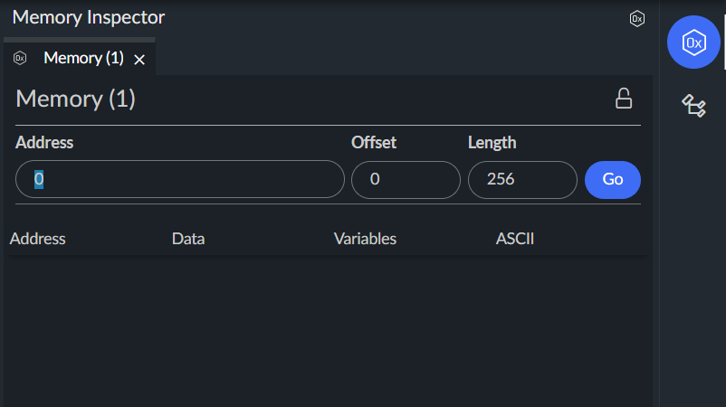

Using this you can type in the address of any memory location and view its contents. This is very useful when dealing with the flash memory later.

### Register Inspection

Viewing the contents of the registers can be extremely useful when debugging. To view the contents of the registers you will first need to start a debugging session. When this is done open the `Registers` window. To do this right click on any of the tabs in the debugging window and select `Registers`.


When a debugging session is active you will see the following:

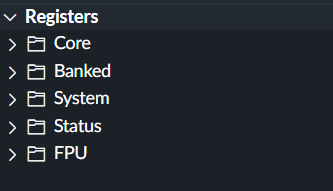

To view the contents of the CPU registers click on the `Core` tab, you should now be able to see registers R0 - R15.