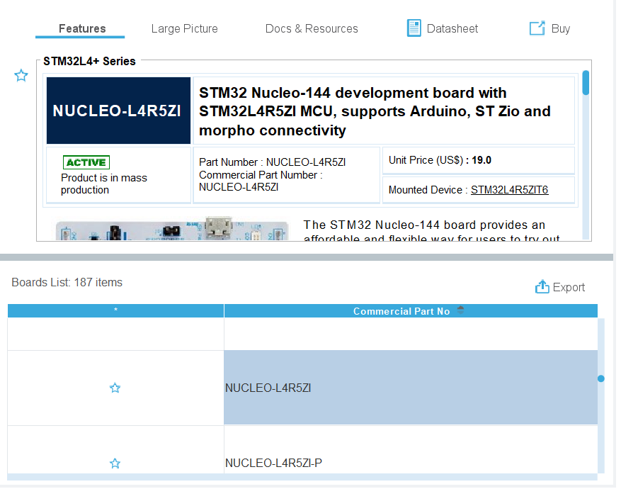
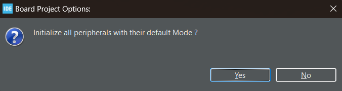

# Getting Started With An STM32L4R5ZI Board

## Introduction
The STM32L4R5ZI is a 32-bit ARM Cortex-M4 microcontroller. It contains 2MB flash memory, 64KB of SRAM and a 120MHz clock frequency. These microcontrollers have been designed to run at ultra-low power, making them ideal for high performance battery power applications.

## Prerequisites
To follow this tutorial, you will:
- A [STM32L4R5ZI Board](https://www.st.com/en/microcontrollers-microprocessors/stm32l4r5zi.html)
- A USB Type-A to Micro-B cable
- An understanding of the [C programming language](https://en.wikipedia.org/wiki/C_(programming_language)) 
- Optionally some knowledge of [ARM assembly](https://en.wikipedia.org/wiki/ARM_architecture_family#Instruction_set).

# Installation

In order to run the necessary software you will need to have have 64-bit Java installed. You can download the latest version of Java [here](https://www.java.com/en/download/).

## STM32CubeMX

STM32CubeMX is a graphical tool that allows for the easy configuration of an ARM Cortex-M microcontroller. It allows for the configuration of the microcontroller's peripherals and generates the necessary code to run on the microcontroller.

### Installation

To install STM32CubeMX, download the latest version from [here](https://www.st.com/en/development-tools/stm32cubemx.html). To access the download you will have to accept their terms and conditions. You will then have to enter your email. You should receive an email with a link to download the software. Once downloaded, run the installer and follow the instructions.

## STM32CubeIDE

The next piece of software you will need is the STM32CubeIDE. This is an integrated development environment that contains all the necessary tools for building and debugging your code. It is based on the Eclipse IDE so may feel familiar to some.

### Installation

To install the STM32CubeIDE, download the latest version from [here](https://www.st.com/en/development-tools/stm32cubeide.html). To access the download link you will have to follow the same process as above. Once downloaded, run the installer with its default settings.

## STM32CubeProgrammer

The final piece of software is optional but is useful for viewing the contents of the memory outside of a debugging session. It also allows for the programming of the microcontroller's flash memory.

### Installation

To install the STM32CubeProgrammer, download the latest version from [here](https://www.st.com/en/development-tools/stm32cubeprog.html). To access the download link you will have to follow the same process as above. Once downloaded, run the installer with its default settings.

## STM32L4R5ZI Board Drivers

To use our board we will need to install the correct libraries for it:

1. Open the STM32CubeMX program

2. Click on the `Help` tab and then select `Manage embedded software packages`

3. Search through the list for `STM32L4`, expand this and install the latest version (at time of writing this is version 1.17.2)

# Creating a New Project

There is two ways to create a new project using the STM tools. The first is to use STM32CubeMX to generate the necessary code and then import this into the STM32CubeIDE. The second method is to create it directly from STM32CubeIDE. We will use the second method as it is the simplest.

## Creating a New Project in STM32CubeIDE

1. Open the STM32CubeIDE program and select your workspace.
2. It make take some time to first open the program, when it opens go to `File` -> `New` -> `STM32 Project`

3. A new window will open with the following

4. Select the `Board Selector` tab

5. Search through the list of available boards, select `NUCLEO-L4R5ZI` then click `Next`

6. The following window will appear. Enter a name and location to keep the project. We are using C in this tutorial, however you can also use C++ if you wish. Keep all other settings as they are below. Finally click `Finish`

7. A window will appear asking if you want to set up all peripherals with default settings. Click `Yes`

