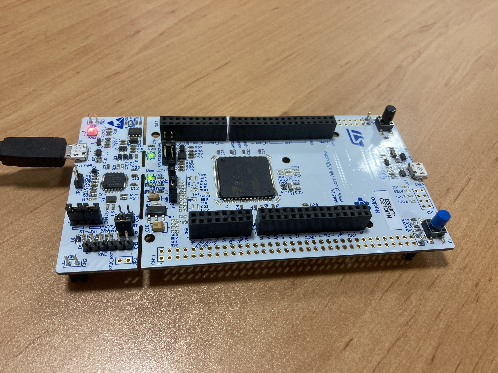

# Using an STM32L4R5ZI Board

## What is this?
The STM32L4R5ZI is a 32-bit ARM Cortex-M4 microcontroller. It contains 2MB flash memory, 64KB of SRAM and a 120MHz clock frequency. These microcontrollers have been designed to run at ultra-low power, making them ideal for high performance battery power applications.

## Guides

This guide will feature a number of tutorials to get you started with the STM32L4R5ZI board. These tutorials will cover the following topics:

- Using STM32CubeIDE - This is a great IDE from ST Microelectronics that allows you to program STM32 microcontrollers using C/C++.
- Using Keil Studio Cloud - This is a web-based IDE that allows you to program STM32 microcontrollers using C/C++ on top of the ARM Mbed OS.

Whatever version you want to use will depend on your needs.

- To access the STM32CubeIDE guide, click [here](./STM32CubeIDE/README.md).
- To access the Keil Studio Cloud guide, click [here](./KeilStudioCloud/README.md).