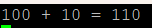
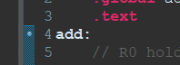
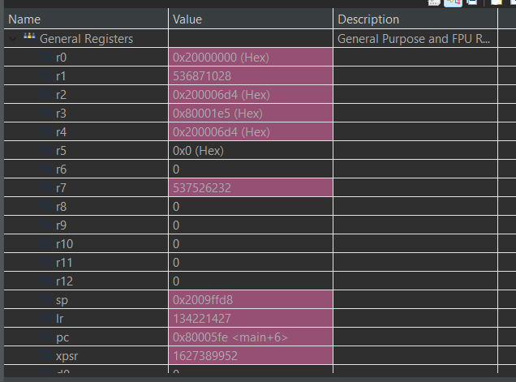
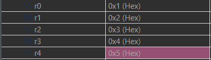
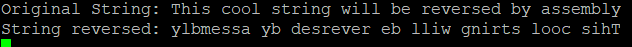

# Assembly

# Contents
- [Assembly](#assembly)
- [Contents](#contents)
- [Introduction](#introduction)
- [Prerequisites](#prerequisites)
- [Setting Up a project](#setting-up-a-project)
	- [Creating the assembly file](#creating-the-assembly-file)
	- [Writing the assembly code](#writing-the-assembly-code)
	- [Calling the function from C](#calling-the-function-from-c)
	- [Debugging the assembly code](#debugging-the-assembly-code)
- [Advanced Examples](#advanced-examples)
	- [Passing multiple parameters](#passing-multiple-parameters)
	- [Reversing a string](#reversing-a-string)

# Introduction

This project is a simple example of how to run ARM assembly code on an STM32L4R5ZI microcontroller. We will not be writing the entire program in assembly, but rather making small functions that can be called from C/C++ code. This is useful for writing time critical code, or code that needs to be very small.

# Prerequisites

- A basic knowledge of [ARM assembly](https://developer.arm.com/documentation/den0013/d/Introduction-to-Assembly-Language)
- It is recommended to complete the [Serial Output tutorial](../SerialOutput/) before attempting this tutorial

# Setting Up a project

Feel free to download this project and import it into STM32CubeIDE. If you are unsure how to do this, please refer to the [STM32CubeIDE importing projects](../../README.md#opening-a-project).

As we are going to be using printf in this tutorial you will need to set this up as shown in the [Serial Output tutorial](../SerialOutput/README.md#using-printf).

## Creating the assembly file

To get started we first need to create a new assembly file. To do this, open the `Src` folder found within the `Core` folder. Right click on the `Src` folder and select `New` -> `File`.


A new window will appear enter the name add.s. The .s extension is used for assembly files. Click `Finish` to create the file.


## Writing the assembly code

To showcase the basics of assembly we are going to be writing a simple function that takes a number in from C and adds 10 to it. We will then return this value to C. To do this we first need to set up our assembly file. Open it and copy the following code into it:

```ARM
	.syntax unified
	.global add
	.text
add:
	.data
```

- `.syntax unified` tells the assembler to use the unified syntax. This is a common syntax across both THUMB and ARM instructions
- `.global add` this exposes our function to C
- `.text` tells the assembler that the following is the start of the text section where the instructions will be stored. This section is read-only
- `.data` tells the assembler that the following is the start of the data section where the data will be stored. This section is read-write

When we call our assembly instruction it will execute from the label that we define through `.global` in our case this will be the `add:` label.

Next we need to define our function. We will define a constant `.word` of `10`. Load it into memory and add it to the value passed in from C. We will then return the value to C.

We will define our data label first:

```ARM
	.syntax unified
	.global add
	.text
add:
	.data
num:
    .word 10
```

Next we load the the `num` label into a register. We will load the labels memory address into `R1` and then load the data from that address into `R1`.

```ARM
	.syntax unified
	.global add
	.text
add:
    LDR R1, =num // loads the address of num into R1
	LDR R1, [R1] // loads the data from the address in R1
	.data
num:
    .word 10
```

Finally we need to perform our addition on the value passed in. To access values passed in from C we can refer to the ARM user guide, it states:


Knowing this we can access the value we pass in from C by using `R0`.

```ARM
	.syntax unified
	.global add
	.text
add:
    LDR R1, =num
	LDR R1, [R1]
    ADD R0, R0, R1 // Adds the value from C to the value in R1
	.data
num:
    .word 10
```

To return a value the ARM user guide states:


As we store the result of our addition in `R0` it will be returned to C.

Finally we need to branch back to the calling C function. This can be achieved by adding `BX LR` to the end of the function. All this instruction is doing is telling our program to branch back to the address found in the `Link Register`.

**N.B You must include `BX LR` at the end of every function you call, otherwise you will see undefined behavior.**

```ARM
	.syntax unified
	.global add
	.text
add:
    LDR R1, =num
	LDR R1, [R1]
    ADD R0, R0, R1
    BX LR
	.data
num:
    .word 10
```

## Calling the function from C

Now that we have written our assembly function we need to call it from C. To do this we need to define a function prototype in our `main.c` file. After the `/* USER CODE BEGIN 0 */`, add the following:

```C
extern int add(int myNumber);
```

If you are using C++ the the syntax differs slightly:

```cpp
extern "C" int add(int myNumber);
```

**The function name must be the same as the `global` label you define in your assembly**

We can now call this function anywhere from our `main.c` file.

```C
int number = 100;
int res = add(number);
printf("%d + 10 = %d\r\n", number, res);
```

The output will be as below:



## Debugging the assembly code

The STM32CubeIDE offers some excellent facilities for debugging assembly code. It allows us to step through instructions just like stepping through C code.

We can add a breakpoint in assembly just like we do in C. When the debugger reaches this point it will pause and allow you to step through the instructions normally.



Viewing the registers can be very useful as you step through the instructions. To open the registers window, go to `Window` -> `Show View` -> `Registers`.



**N.B - A register will turn pink when its value changes.**

# Advanced Examples

Below is an example of some more advanced features that can be used.

## Passing multiple parameters

As already seen we can pass values into our assembly function from C. If we are passing 4 or less parameters they will be passed in through registers `R0` to `R3`. However if we pass more than 4 parameters they will be passed in through the stack, meaning we will need to access them through the stack pointer `SP`.

Take the following function prototype in C:

```C
extern void pass_five_values(int a, int b, int c, int d, int e);
```

Here we are passing 5 parameters so `a` to `d` will be passed in through registers `R0` to `R3` and `e` will be passed in through the stack.

In a file called `pass_five_values.s` I have the following assembly.

```ARM
	.syntax unified
	.global pass_five_values
	.text
pass_five_values:
	LDR R4, [SP]
	BX LR
```

Here we are loading the value of `e` from the stack into `R4`. `SP` is known as the `Stack Pointer`, it points to the position in memory where the top of the stack is, which is also where our last value is found.

If we now call our function from C:

```C
pass_five_values(1, 2, 3, 4, 5);
```

When debugging this function we can see that `R0 - R4` contains the correct values.



## Reversing a string

Below is an example of reversing a string in assembly. The function prototype in C is as follows:

```C
extern void reverse_string(char* string, int size);
```

The function takes in a pointer to a string and the size of the string.

The string will be reversed in place, meaning the original string will be modified and the reversed string will be stored in the same location. This explains why we have a return type of `void` here.

Below is the code for the assembly function:

```ARM
	.syntax unified
	.global reverse_string
	.text
reverse_string:
	MOV R2, R0 // up counter
	SUB R1, R1, #2 // sub two, one to account for index and one for the '\0'
	ADD R3, R2, R1 // down counter
loop:
	LDRB R4, [R2] // load first char
	LDRB R5, [R3] // load last char
	STRB R5, [R2] // put first char into position of last
	STRB R4, [R3] // put last char into position of first
	SUB R3, R3, #1 // decrement down counter
	ADD R2, R2, #1 // increment up counter
	CMP R3, R2 // compare up and down counters
	BGT loop // if down counter is greater than up counter, loop
	BX LR
```

We can call this function from C as follows:

```C
char data[] = "This cool string will be reversed by assembly";
printf("Original String: %s\r\n", data);
reverse_string(data, sizeof(data));
printf("String reversed: %s\r\n", data);
```

**N.B - Your string must be a char array to be modifiable in place**

The output will be as follows:



Feel free to experiment with this code and see if you can improve it.