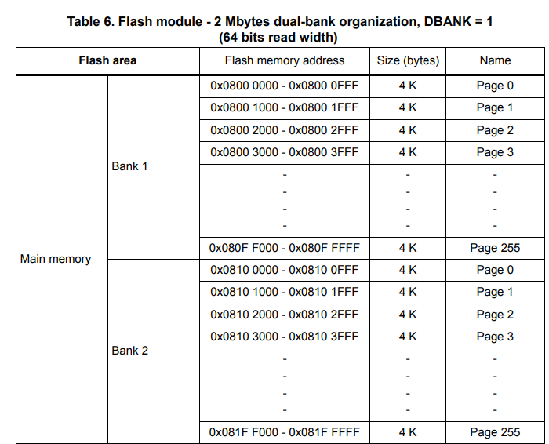
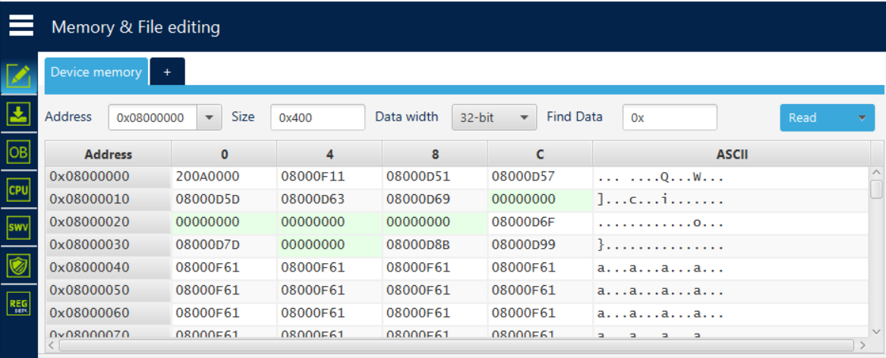
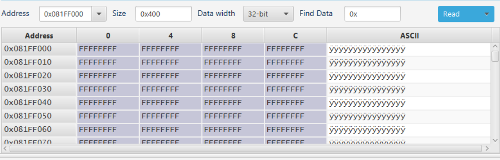
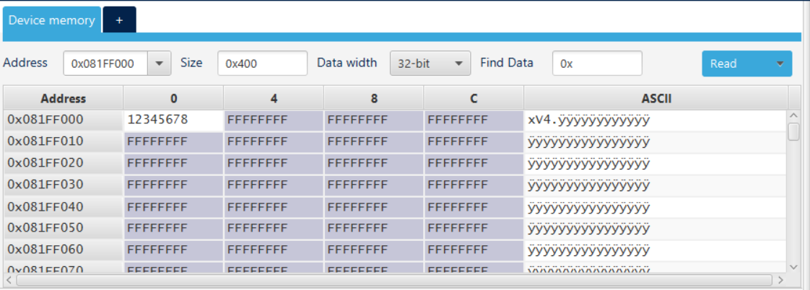
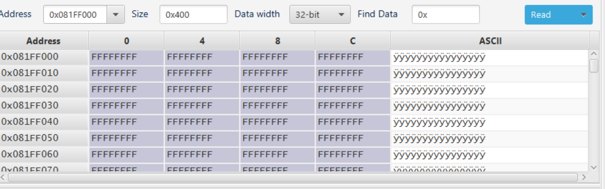
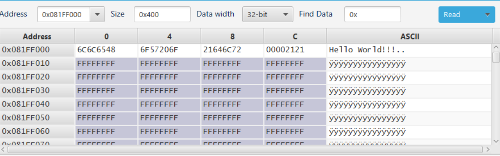
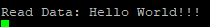

# Using the Flash Memory

# Contents
- [Using the Flash Memory](#using-the-flash-memory)
- [Contents](#contents)
- [Introduction](#introduction)
- [Understanding the Flash Memory](#understanding-the-flash-memory)
  - [Writing to Flash](#writing-to-flash)
- [Code](#code)
  - [Erase](#erase)
  - [Checking The Erase Function](#checking-the-erase-function)
  - [Writing Data](#writing-data)
  - [Complete Function](#complete-function)
  - [Checking The Write Function](#checking-the-write-function)
  - [Reading Data](#reading-data)
- [References](#references)

# Introduction

This project is aimed to sho you how to use the [flash memory](https://en.wikipedia.org/wiki/Flash_memory) available on an STM32L4R5ZI board. The flash memory is a non-volatile memory that can be used to store data such as configuration settings, that will not be lost when the board is powered off. Programming the flash memory can be tricky and requires a basic understanding of the structure of the flash memory.

Before completing this tutorial I would recommend at least completing the [Serial Output](../SerialOutput/README.md) tutorial first.

Either create your own project or import this one using the method described [here](../../README.md#opening-a-project).

# Understanding the Flash Memory

Flash memory is described as non-volatile meaning when our device loses power the contents of the flash will not ne lost. This is different to RAM which is volatile meaning when our device loses power the contents of the RAM will be lost.

In an STM32L4R5ZI board we have 2MB flash memory. However this memory is not all available for us to use. When you create a new program and upload it to the board it will be stored in flash memory also, this limits how much flash we can use, but as long as your programs are not extremely large you should be ok.

To understand the structure of the flash we need to look at the data sheet, which can be found [here](https://www.st.com/resource/en/reference_manual/rm0432-stm32l4-series-advanced-armbased-32bit-mcus-stmicroelectronics.pdf). In this we will be able to find a diagram on page 117.



From this diagram we can see that our flash is split into 2 banks each with 256 pages of 4KB each. When we upload a program it is stored from the first page of the first bank and uses as mush space as it needs. To ensure that we do not interfere with our program data we will use the very last page of bank 2.

## Writing to Flash

When you want to program some data to any flash memory we must first erase the page or pages that we will be writing to, this means we will lose any data already written their so we must be careful what pages we choose to erase.

The last thing to mention is that this board has a read width of 64 bits, this means that we must read and write 64 bits at a time. This is important to remember when we are writing our code.

# Code

## Erase

To make this code more understandable we will create a function to allow us to write to flash memory. This function will take the address of the start of the page we want to begin writing to, the data we want to write and the number of words the data is. Define the following function in your main.c file.

```c
uint32_t FlashData(uint32_t startPageAddr, uint64_t* data, uint32_t numberWords);
```

To set up this function we first need to unlock the flash memory. Normally the flash ahs protections in place to stop accidental writes to it, however we temporarily disable this to allow us to program our own data.

```c
uint32_t FlashData(uint32_t startPageAddr, uint64_t* data, uint32_t numberWords)
{
  HAL_FLASH_Unlock();
}
```

Next we have to create a new struct that we use to define what to erase.

```c
uint32_t FlashData(uint32_t startPageAddr, uint64_t* data, uint32_t numberWords)
{
  HAL_FLASH_Unlock();
  
  FLASH_EraseInitTypeDef EraseInitStruct;
}
```

This struct makes us define 4 things:

- TypeErase - Defines what type of erase we want to do, either a mass erase or just certain pages, we simply want to erase just certain pages
- Page - this is the number if the page within the bank, for example we are using page 255 of bank 2.
- NbPages - This is the number of pages we want to erase, we only want to erase 1 page.
- Banks - This is the bank our page is in, we are using bank 2

```c
uint32_t FlashData(uint32_t startPageAddr, uint64_t* data, uint32_t numberWords)
{
  HAL_FLASH_Unlock();

  FLASH_EraseInitTypeDef EraseInitStruct;

  EraseInitStruct.TypeErase = FLASH_TYPEERASE_PAGES;
  EraseInitStruct.Page = GetPage(startPageAddr);
  EraseInitStruct.NbPages = 1;
  EraseInitStruct.Banks = 2;
}
```

In this example we have defined a function called GetPage, this allows us to get the page number based on the address we supply. This function is defined below.

```c
/**
    Function taken from 
    https://github.com/STMicroelectronics/STM32CubeL4/blob/82e7ade76252f4c973c9fc7515ebc42b850b7c0b/Projects/NUCLEO-L4R5ZI/Examples/FLASH/FLASH_EraseProgram/Src/main.c#L190
**/

static uint32_t GetPage(uint32_t Addr)
{
  uint32_t page = 0;

  if (Addr < (FLASH_BASE + FLASH_BANK_SIZE))
  {
    /* Bank 1 */
    page = (Addr - FLASH_BASE) / FLASH_PAGE_SIZE;
  }
  else
  {
    /* Bank 2 */
    page = (Addr - (FLASH_BASE + FLASH_BANK_SIZE)) / FLASH_PAGE_SIZE;
  }

  return page;
}
```

Now that we have defined our erase struct we can erase the page we want to write to.

```c
uint32_t FlashData(uint32_t startPageAddr, uint64_t* data, uint32_t numberWords)
{
  HAL_FLASH_Unlock();
  
  FLASH_EraseInitTypeDef EraseInitStruct;

  EraseInitStruct.TypeErase = FLASH_TYPEERASE_PAGES;
  EraseInitStruct.Page = GetPage(startPageAddr);
  EraseInitStruct.NbPages = 1;
  EraseInitStruct.Banks = 2;
  
  uint32_t PAGEError;
  if (HAL_FLASHEx_Erase(&EraseInitStruct, &PAGEError) != HAL_OK)
  {
	  return HAL_FLASH_GetError();
  }

  HAL_FLASH_Lock();
  return 0;
}
```

This function attempts to erase the page we have defined, if it fails it will return an error code.

## Checking The Erase Function

To check if our function is working at this stage we can use the [STM32CubeProgrammer](https://www.st.com/en/development-tools/stm32cubeprog.html) to check the contents of the flash memory. To do this open the STM32CubeProgrammer and connect to your board. Ensure you have no active debug sessions and select `ST-LINK` as the connection option.


Once connected click on the `Memory & File editing` section and you should see something similar to the image below.



The address of our page is `0x081FF000`, if we enter that into the `Address` box and click `Read` we should see that all our data is currently set to `0xFF`.



We can now change some of the memory in this page through the programmer. We can then run our program and see that the memory will be reset. To change a word of memory simply double click it and enter the new value.



We can now call our function in our main method as follows:

```c
uint32_t error = FlashData((uint32_t)0x081FF000, 0, 0);
printf("Error: %d\r\n", error);
```

After we run this you should see the error code as `0` indicating no problem. Checking STM32CubeProgrammer again we can see that the memory has been reset.



## Writing Data

Writing data is quite simple. All that is needed is to loop through our data and write to the flash. Note that we must write 64 bits at a time and we must write to the page that we erased previously.

To get started we can simply have a loop that iterates through our data.

```c
int doubleWordsWritten = 0;

while (doubleWordsWritten * 2 < numberWords)
{

}
```

The variable `doubleWordsWritten` is used to keep track of how many double words we have written to the flash. We keep track of double words because we are writing 64 bits at a time.

Next we need to flash the memory this can be done using the following code:

```c
int doubleWordsWritten = 0;

while (doubleWordsWritten * 2 < numberWords)
{
  if (HAL_FLASH_Program(FLASH_TYPEPROGRAM_DOUBLEWORD, startPageAddr, data[doubleWordsWritten]) != HAL_OK)
  {
  	HAL_FLASH_Lock();
  	return HAL_FLASH_GetError();
  }
  startPageAddr += 8;
  doubleWordsWritten++;
}
```

The function `HAL_FLASH_Program` is what we use to program data into the flash memory. As can be seen we are programming a double word (64 bits), we use the address we supplied as the starting location. As our data is a 64 bit pointer we can simply access the first 64 bits by accessing element 0.

If this function fails we return the error code and lock the flash memory.

If it does not fail we will increment the address by 8 (64 bits) and increment the number of double words written.

## Complete Function

The complete function is shown below:

```c
uint32_t FlashData(uint32_t startPageAddr, uint64_t* data, uint32_t numberWords)
{
  // unlocks the flash memory
  HAL_FLASH_Unlock();

  // define a struct that contains information to erase the flash memory
  FLASH_EraseInitTypeDef EraseInitStruct; 
  EraseInitStruct.TypeErase = FLASH_TYPEERASE_PAGES;
  EraseInitStruct.Page = GetPage(startPageAddr);
  EraseInitStruct.NbPages = 1;
  EraseInitStruct.Banks = 2;

  uint32_t PAGEError;
  if (HAL_FLASHEx_Erase(&EraseInitStruct, &PAGEError) != HAL_OK)
  {
  	return HAL_FLASH_GetError();
  }

  int doubleWordsWritten = 0; 
  while (doubleWordsWritten * 2 < numberWords)
  {
  	if (HAL_FLASH_Program(FLASH_TYPEPROGRAM_DOUBLEWORD, startPageAddr, data[doubleWordsWritten]) != HAL_OK)
  	{
  		HAL_FLASH_Lock();
  		return HAL_FLASH_GetError();
  	}
  	startPageAddr += 8;
  	doubleWordsWritten++;
  }

  HAL_FLASH_Lock(); 
  return 0;
}
```


## Checking The Write Function

To check if this function works correctly we can program some text into the flash memory. To do this we can use the following code:

```c
char* data = "Hello World!!!";
int numWords = strlen(data) / 4 + ((strlen(data) % 4) != 0);
printf("Num Words: %d\r\n", numWords);

uint32_t error = FlashData((uint32_t)0x081FF000, (uint64_t*)data, (uint32_t)numWords);
printf("error: %d\r\n", error);
```

This code will write the string `Hello World!!!` to the flash memory. We calculate the number of words needed for this string based on its length. We then call the function ensuring to cast to the correct data types.

If we use the STM32CubeProgrammer again, we should see at the address `0x081FF000` the string `Hello World!!!` has been programmed.



## Reading Data

Reading data is quite simple, we can simply use a pointer to the address and iterate over the data.

We can define a function called `ReadFlash`:

```c
void ReadFlash(uint32_t address, uint32_t numberWords, uint32_t* buffer)
{

}
```

Here we take in the address we want to start reading from, the number of words we want to read and a buffer to store the data in.

We can then use the following code to read the data:

```c
void ReadFlash(uint32_t address, uint32_t numberWords, uint32_t* buffer)
{
  while (numberWords > 0)
  {
    *buffer = *(uint32_t*)address;
    address += 4;
    buffer++;
    numberWords -= 1;
  }
}
```

Here we simply loop over the data and read it into the buffer word by word.

To call the this function we can use the following code:

```c
uint32_t* readData = malloc(sizeof(uint32_t) * numWords);
ReadFlash(0x081FF000, numWords, readData);
printf("Read Data: %s\r\n", (char*)readData);
```

We allocate some memory to store the data in then we call the function with the same address as to where we wrote to. We then print the data to the console.

This will produce the following output:



# References

This guide uses material from the following sites:

- [controllerstech.com](https://controllerstech.com/flash-programming-in-stm32/)
- [ST GitHub](https://github.com/STMicroelectronics/STM32CubeL4/blob/master/Projects/NUCLEO-L4R5ZI/Examples/FLASH/FLASH_FastProgram/Src/main.c)