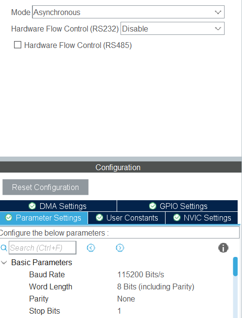
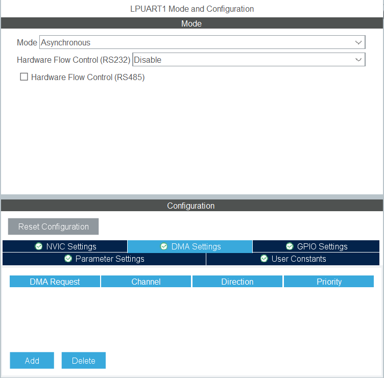
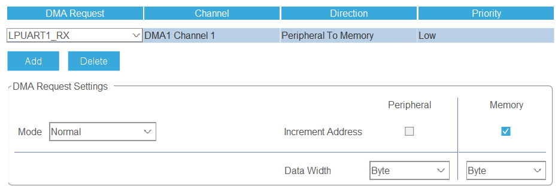
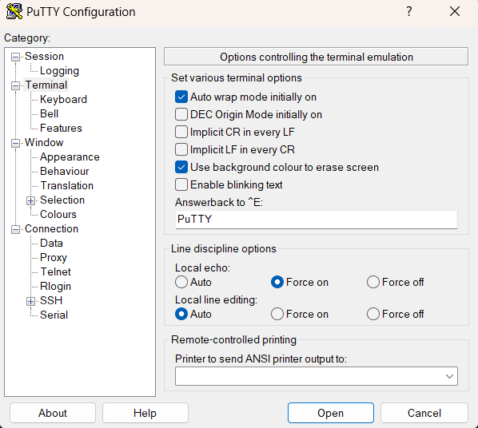

# Serial Input

# Contents
- [Serial Input](#serial-input)
- [Contents](#contents)
- [Introduction](#introduction)
- [Project](#project)
	- [Receiving Data from the UART](#receiving-data-from-the-uart)
	- [Peripheral Setup](#peripheral-setup)
	- [Code](#code)

# Introduction

This project is a simple example of how to send data to the microcontroller over the UART (Universal Asynchronous Receive/Transmit). This is useful for sending data from a host computer to the microcontroller without the need for any external hardware. If you have not already done so, I would recommend completing the [Serial Output](../SerialOutput/README.md) project first. It goes over the basics of UART and how to set it up with printf which we will be using in this tutorial.

# Project

Feel free to download this project and import it into STM32CubeIDE. If you are unsure how to do this, please refer to the [STM32CubeIDE importing projects](../../README.md#opening-a-project).

Alternatively you can create a new project and follow the steps below. When creating a project ensure to initialize the peripherals with default settings when prompted.

## Receiving Data from the UART

There is typically 3 ways to receive data over the UART connection.

The first is to use the `HAL_UART_Receive()` function. This function will block the program until the specified number of bytes have been received or if the specified timeout has been reached. This is not ideal if you want to to do other things while waiting for data.

The second method is to use interrupts. This is a much better method as it allows the program to do other things while waiting for data. However using this method is not suitable for receiving a continuous stream of data.

The final method is to use DMA. DMA stands for `Direct Memory Access`, this allows the UART to write directly to the memory when it receives data, without intervention from the CPU. The DMA will then notify the CPU that the data is in a pre-programmed location in memory. This is the best method for receiving data from the UART and the one that we will be using in this tutorial.

## Peripheral Setup

For this tutorial we are going to be using `LPUART1` again. Set up this peripheral in the same way as the [Serial Output](../SerialOutput/README.md#peripheral-setup) project. 



We now need to enable the DMA peripheral to work with this UART. With the `LPUART1` configuration screen open, select `DMA Settings`.



Click `Add` and select `LPUART1_RX`. Ensure the settings are the same as below (they should be default when adding the DMA channel).



Save the `.ioc` file and generate the code.

## Code

To receive data we will need to set up an interrupt that is called whenever the DMA has received a set amount of data.

The basic way the DMA method works is:

1. Create a buffer to store the data we receive.
2. Set up the DMA to write to this buffer.
3. Set up an interrupt that is called when the DMA has finished writing to the buffer.

First we need to create a buffer to store the data. To keep it simple we will just create a buffer of 1 byte. Add the following code after `/* USER CODE BEGIN 0 */`:

```c
uint8_t byteBuffer = 0;
```

Next we need to start receiving data. We can do that use the `HAL_UART_Receive_DMA()`. This function takes 3 parameters.
- The UART peripheral to use in our case this is `hlpuart1`
- A pointer to the buffer to store the data in
- The number of bytes to receive

Add the following code after `/* USER CODE BEGIN 2 */`:

```c
HAL_UART_Receive_DMA(&hlpuart1, &byteBuffer, 1);
```

This will tell the DMA that when the UART receives one byte of data it should be stored in the `byteBuffer` buffer.

Next we need to set up an interrupt that is called when the DMA has finished writing to the buffer. Add the following code after `/* USER CODE BEGIN 4 */` (will be near the bottom of the file):

```c
void HAL_UART_RxCpltCallback(UART_HandleTypeDef *huart)
{
	if (huart == &hlpuart1)
	{
		printf("\r\nYou entered: %s\r\n", (char*)&byteBuffer);
		HAL_UART_Receive_DMA(&hlpuart1, &byteBuffer, 1);
	}
}
```

This code is quite simple all it is doing is checking if the UART that called the interrupt is the one we are using. If it is then we can print the received data back to the serial monitor. Finally we are calling `HAL_UART_Receive_DMA()` again to tell UART to start receiving data again.

Now we can build and run the code on the board.

If you are using [Putty](https://www.putty.org/), then you may want to turn on local echoing to see what you are typing. To do this go to `Terminal -> Local Echo -> Force On`.



Now when you type into the serial monitor you should see the data being printed back to you.

