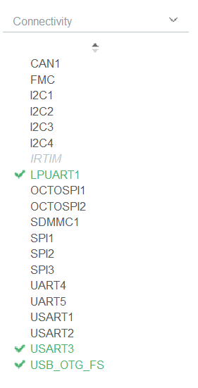
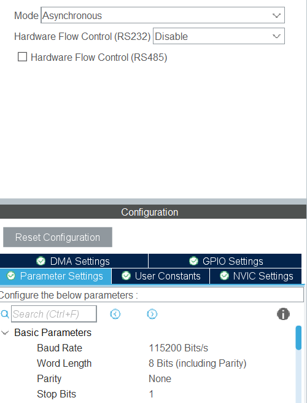
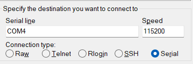
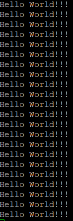
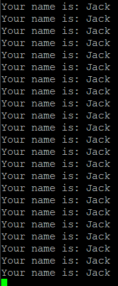

# Serial Output

# Contents
- [Serial Output](#serial-output)
- [Contents](#contents)
- [Introduction](#introduction)
- [Project](#project)
  - [Peripheral Setup](#peripheral-setup)
  - [Printing Data](#printing-data)
  - [Using printf](#using-printf)

# Introduction

This project is a simple example of how to use the serial output on the STM32L4R5ZI board. As this board has a built-in debugger, this allows us to use the serial output without any additional hardware. To output we need to use UART (Universal Asynchronous Receiver/Transmitter). This allows us to send data back and forth between the board and our computer, this is extremely useful for debugging and for displaying information without the need for an external screen.

# Project

Feel free to download this project and import it into STM32CubeIDE. If you are unsure how to do this, please refer to the [STM32CubeIDE importing projects](../../README.md#opening-a-project).

Alternatively you can create a new project and follow the steps below. When creating a project ensure to initialize the peripherals with default settings when prompted.

## Peripheral Setup

To start using the UART we need to set it up correctly. Open the .ioc configuration file and navigate to the `Connectivity` tab. Here we can enable the UART peripheral.



Next we need to configure the UART peripheral. To do this click on `LPUART1` (Low Power UART). In the `Parameter Settings` tab we can configure the UART peripheral. Set the options to the same as below:



Save the configuration and allow it to generate the necessary code.

## Printing Data

Now that we have the correct UART device set-up we can start looking at some code.

To output we can use the function provided by the HAL (Hardware Abstraction Layer)

```c
HAL_UART_Transmit(&UART_DEVICE, data, sizeof(data), delay);
```

This function takes 4 arguments:
- A reference to the UART device we want to use
- A pointer to the data we want to send
- The size of the data we want to send
- Timeout duration

In our case we can send a simple string forever with a time delay of 1 second.

```c
char data[] = "Hello World!!!\r\n";
HAL_UART_Transmit(&hlpuart1, data, sizeof(data), 100);
HAL_Delay(1000);
```

Put the above code into the main loop after `/* USER CODE BEGIN 3 */` to preserve it after code generation.

**N.B When outputting a string you must include the `\r\n` at the end. This is because the serial monitor expects a new line character to be sent to it before it will display the data.**

Now compile and run the code onto the board. To actually see the output we will need a serial monitor. STM32CubeIDE has one built-in but it is not very easy to use. I recommend using [Putty](https://www.putty.org/).

Open up Putty, you now need to enter the COM port of the board and the speed. To find the COM port your board is using open the device manager and look under `Ports (COM & LPT)`. The COM port should be listed as `STMicroelectronics STLink Virtual COM Port`.


In my case this is COM4, it will most likely be **different** for you.

Now enter this into putty along with the speed of 115200. Ensure to select `Serial` as the connection type.



Now click `Open` and you should see the output from the board.



## Using printf

If you have ever used C before you will know the standard way to output data is using `printf`. This is a very useful function and it would be nice to be able to use it.

To do this we first need to import the standard IO library, ensure to put into the `/* USER CODE BEGIN Includes */` section.

```c
#include <stdio.h>
```

Now we need to setup the function prototype to allow `printf` to be used. To do that we need to add the following code below the `/* USER CODE BEGIN PFP */` tag.
```c
#ifdef __GNUC__
#define PUTCHAR_PROTOTYPE int __io_putchar(int ch)
#else
#define PUTCHAR_PROTOTYPE int fputc(int ch, FILE *f)
#endif

PUTCHAR_PROTOTYPE
{
  HAL_UART_Transmit(&hlpuart1, (uint8_t *)&ch, HAL_MAX_DELAY);
  return ch;
}
```

All this does is redefine the `printf` function to output to the UART device instead of the console.

Now we can use `printf` as normal. To test this we can output the value of a variable.

```c
const char* name = "Jack";
printf("Your name is: %s\r\n", name);
```

When you compile and run your code you should see the appropriate output in the serial monitor.



Using the printf function is preferred over using the HAL function directly for a number of reasons.
- Better code readability
- Easier to use
- Access to the powerful printf formatting options