# Getting Started With An STM32L4R5ZI Board

## Contents
- [Getting Started With An STM32L4R5ZI Board](#getting-started-with-an-stm32l4r5zi-board)
  - [Contents](#contents)
- [Prerequisites](#prerequisites)
- [Installation](#installation)
  - [STM32CubeMX](#stm32cubemx)
    - [Installation](#installation-1)
  - [STM32CubeIDE](#stm32cubeide)
    - [Installation](#installation-2)
  - [STM32CubeProgrammer](#stm32cubeprogrammer)
    - [Installation](#installation-3)
  - [STM32L4R5ZI Board Drivers](#stm32l4r5zi-board-drivers)
- [Creating a New Project](#creating-a-new-project)
  - [Creating a New Project in STM32CubeIDE](#creating-a-new-project-in-stm32cubeide)
  - [Configuring the Project](#configuring-the-project)
  - [Flashing an LED](#flashing-an-led)
- [Debugging](#debugging)
  - [Advanced Debugging](#advanced-debugging)
    - [Variables](#variables)
    - [Registers](#registers)
    - [Memory](#memory)
    - [Disassembly](#disassembly)
- [Opening a Project](#opening-a-project)
- [Code Examples](#code-examples)
  - [Example Projects](#example-projects)

# Prerequisites
To follow this tutorial, you will:
- A [STM32L4R5ZI Board](https://www.st.com/en/microcontrollers-microprocessors/stm32l4r5zi.html)
- A USB Type-A to Micro-B cable
- An understanding of the [C programming language](https://en.wikipedia.org/wiki/C_(programming_language)) 
- Optionally some knowledge of [ARM assembly](https://en.wikipedia.org/wiki/ARM_architecture_family#Instruction_set).

# Installation

In order to run the necessary software you will need to have have 64-bit Java installed. You can download the latest version of Java [here](https://www.java.com/en/download/).

## STM32CubeMX

STM32CubeMX is a graphical tool that allows for the easy configuration of an ARM Cortex-M microcontroller. It allows for the configuration of the microcontroller's peripherals and generates the necessary code to run on the microcontroller.

### Installation

To install STM32CubeMX, download the latest version from [here](https://www.st.com/en/development-tools/stm32cubemx.html). To access the download you will have to accept their terms and conditions. You will then have to enter your email. You should receive an email with a link to download the software. Once downloaded, run the installer and follow the instructions.

## STM32CubeIDE

The next piece of software you will need is the STM32CubeIDE. This is an integrated development environment that contains all the necessary tools for building and debugging your code. It is based on the Eclipse IDE so may feel familiar to some.

### Installation

To install the STM32CubeIDE, download the latest version from [here](https://www.st.com/en/development-tools/stm32cubeide.html). To access the download link you will have to follow the same process as above. Once downloaded, run the installer with its default settings.

## STM32CubeProgrammer

The final piece of software is optional but is useful for viewing the contents of the memory outside of a debugging session. It also allows for the programming of the microcontroller's flash memory.

### Installation

To install the STM32CubeProgrammer, download the latest version from [here](https://www.st.com/en/development-tools/stm32cubeprog.html). To access the download link you will have to follow the same process as above. Once downloaded, run the installer with its default settings.

## STM32L4R5ZI Board Drivers

To use our board we will need to install the correct libraries for it:

1. Open the STM32CubeMX program

    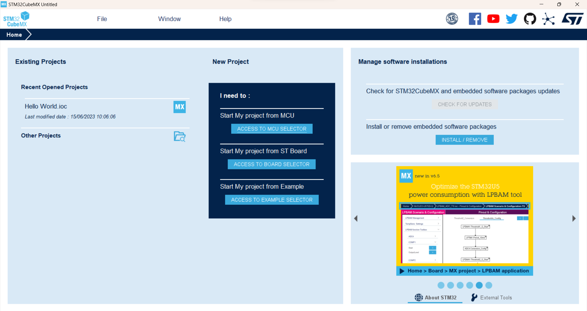

2. Click on the `Help` tab and then select `Manage embedded software packages`

    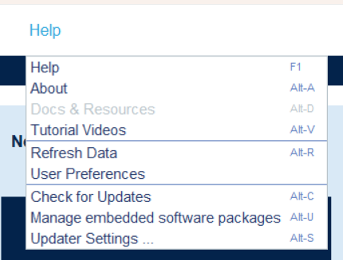

3. Search through the list for `STM32L4`, expand this and install the latest version (at time of writing this is version 1.17.2)

    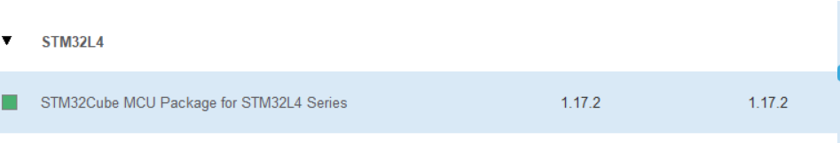

# Creating a New Project

There is two ways to create a new project using the STM tools. The first is to use STM32CubeMX to generate the necessary code and then import this into the STM32CubeIDE. The second method is to create it directly from STM32CubeIDE. We will use the second method as it is the simplest.

## Creating a New Project in STM32CubeIDE

1. Open the STM32CubeIDE program and select your workspace.
2. It make take some time to first open the program, when it opens go to `File` -> `New` -> `STM32 Project`

    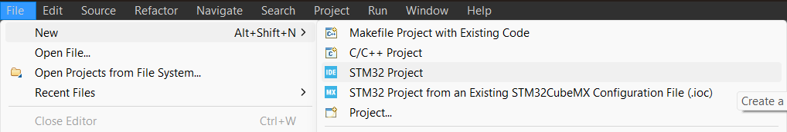

3. A new window will open with the following

    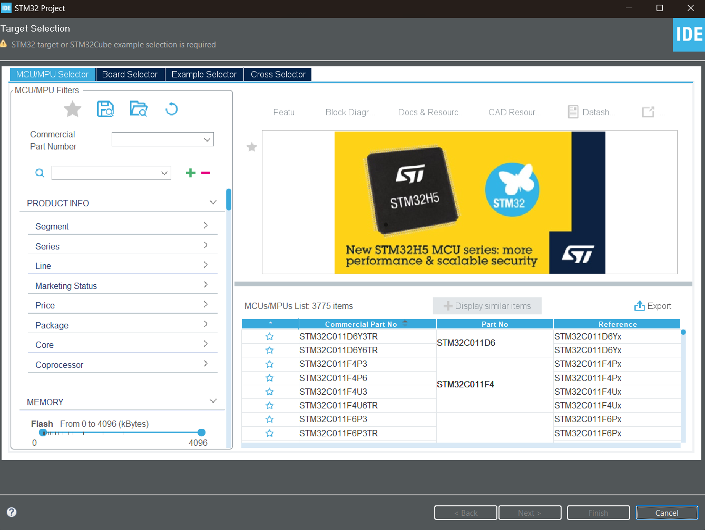

4. Select the `Board Selector` tab

    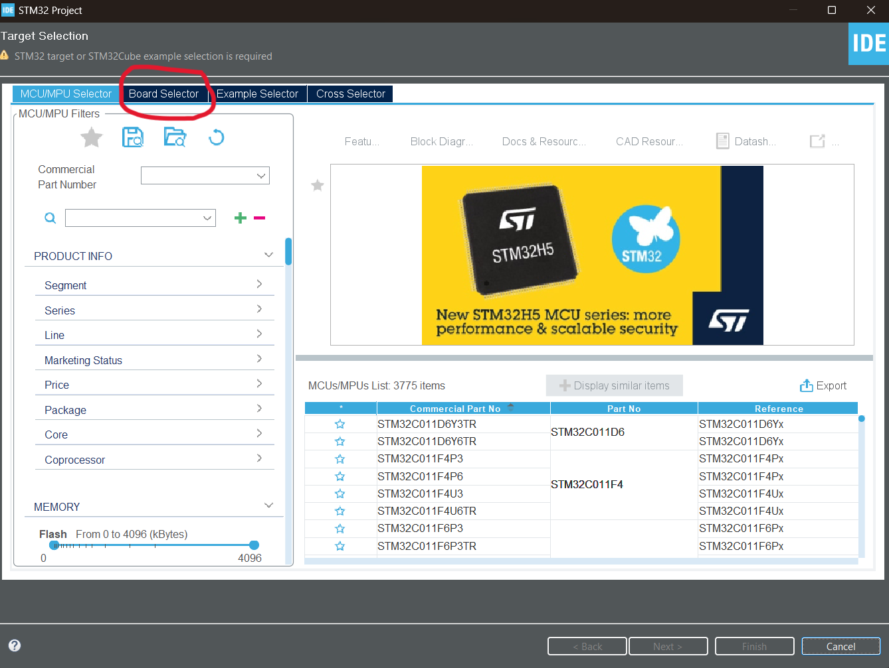

5. Search through the list of available boards, select `NUCLEO-L4R5ZI` then click `Next`

    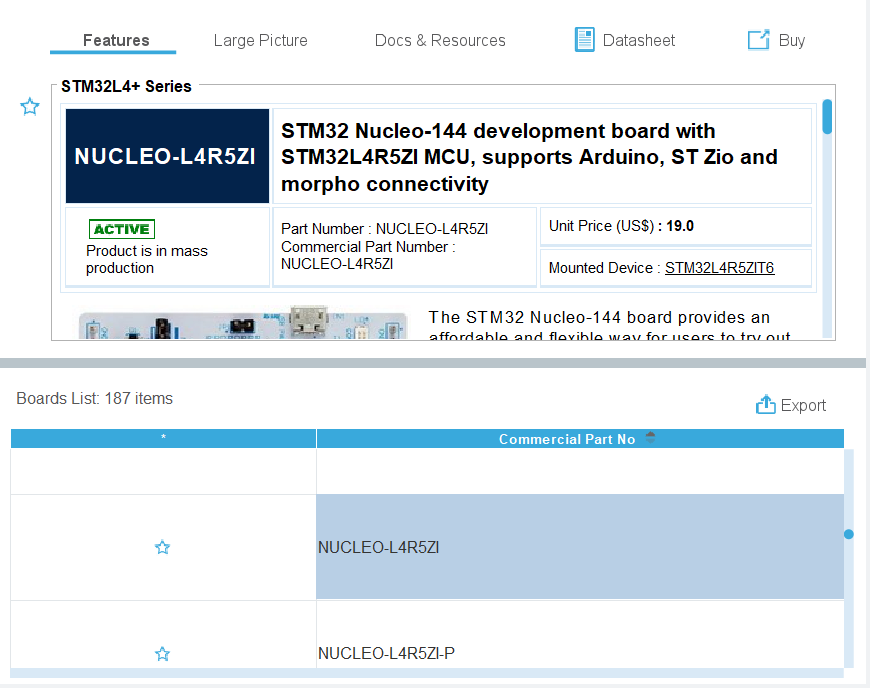

6. The following window will appear. Enter a name and location to keep the project. We are using C in this tutorial, however you can also use C++ if you wish. Keep all other settings as they are below. Finally click `Finish`

    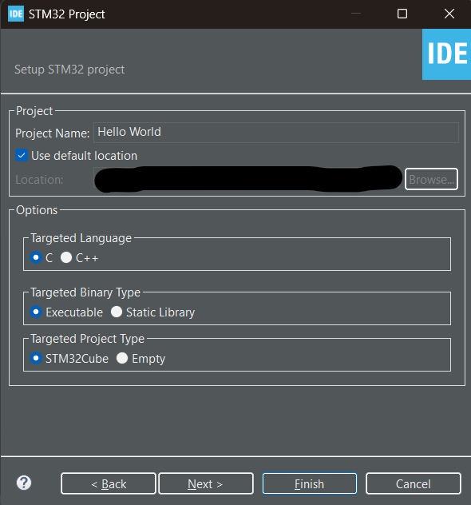

7. A window will appear asking if you want to set up all peripherals with default settings. Click `Yes`

    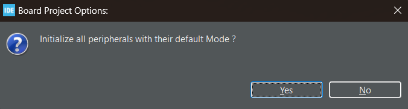

8. The project will now be created. This may take some time. Once it is complete you will see your project in the `Project Explorer` window.

    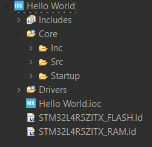

## Configuring the Project

1. To configure the project double click the `.ioc` file in the `Project Explorer` window. This will open the STM32CubeMX program inside the IDE.

    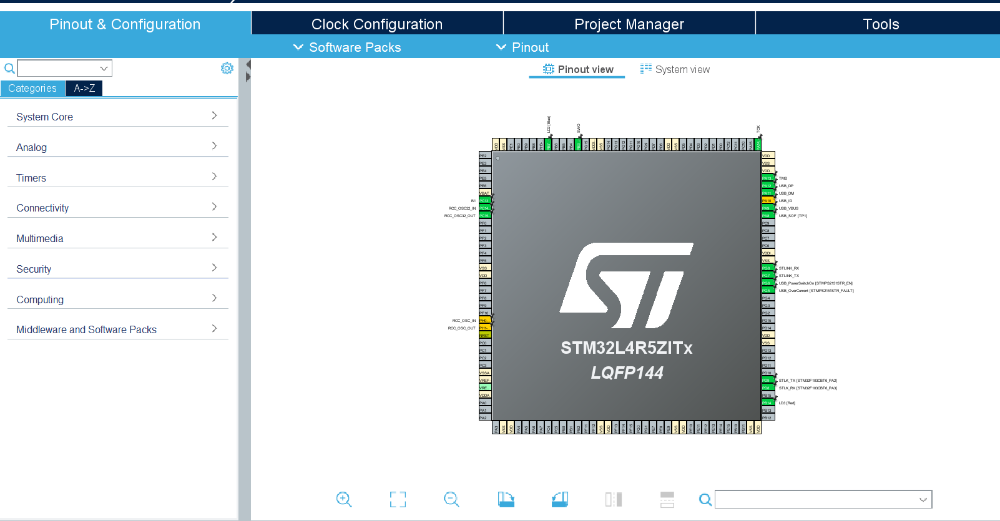

2. Click on the `Project Manager` -> `Code Generator`. Ensure the options are the same as below

    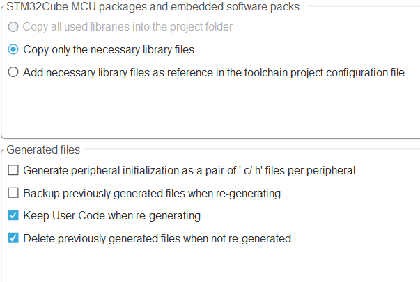

    This will ensure that the your code is kept if you make any setup changes in the future.

## Flashing an LED

Now that we have our project set up we can start writing some code. We are going to flash the green onboard LED on the board. This is a simple task to ensure everything is working correctly.

1. Open the `.ioc` file again to view the pins of the microcontroller. Look for `PC7`. Click on it and set the mode to `GPIO_Output`. Ensure to save the changes, you will then be prompted to generate code, **always** click `Yes` or you will not see your changes.

    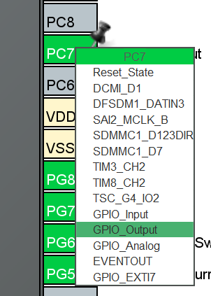

2. Open the `main.c` file from `Core/Src` in the `Project Explorer` window. Locate the `main` method and add the following code after `/* USER CODE BEGIN 3 */` in the `while` loop

    ```c
    HAL_GPIO_TogglePin(GPIOC, GPIO_PIN_7);
	HAL_Delay(500);
    ```

    This will toggle the state of the pin that the green LED is connected to. It will then wait for 500ms before toggling it again. As this is in the `while` loop it will continue to do this forever.

3. To build our project go to `Project` -> `Build Project`. This will build our project and generate the necessary files to run on the microcontroller.

4. To flash our project and run it we go to `Run` -> `Run`, a window may appear asking you to edit the launch configuration. Click `OK` and the program will be flashed to the microcontroller.

5. Observer the board, the green LED should be toggled on and off every half a second.

    

# Debugging

The STM32L4R5ZI comes with a built in debugger. This allows us to step through our code and view some very useful information such as variables, registers and memory.

1. Add a breakpoint to our code to set it to automatically stop when it reaches this point. To do this `right click` the line number of the line you want to stop at and select `Toggle Breakpoint`

    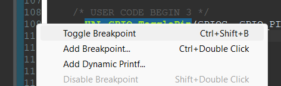

    It will appear as a blue dot beside the line number indicating that it is a breakpoint.

    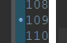

2. Start debugging by going to `Run` -> `Debug`. It may ask you to switch to the `Debug Perspective`, click `Yes`. The editor will change slightly to show the `Debug` window.

3. Before running the program the debugger always stops on the first line of the `main` function. To continue to our breakpoint press the `Resume` button in the top left.

    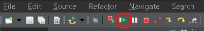

4. This will run until the breakpoint we set earlier. The line will be highlighted and we can choose what to do next. We can step through the code line by line using the `Step Over` button. This will execute the current line and move to the next. We can also step into a function using the `Step Into` button. This will move to the next line of code and if it is a function it will move into that function.

    We will step over the TogglePin function.

    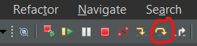

5. We will now see that our LED has turned on and our debugger is waiting for our next command.

6. To stop debugging we can click the `Terminate` button in the top left.

    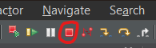


## Advanced Debugging

The debugger has many more features that we can use to help us debug our code. Three very useful features are the ability to view variables, registers and memory.

For these features to be available you will need to be in an active debugging session.

### Variables

If we want to view the variables when debugging we can use the `Variables` window. This will show us the current value of all variables in the current scope. To view this window go to `Window` -> `Show View` -> `Variables`.
    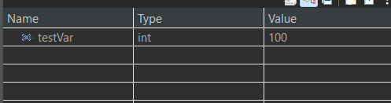

### Registers

To view the processors registers we can the `Registers` window. This will show us the current value of all registers. To view this window go to `Window` -> `Show View` -> `Registers`.
    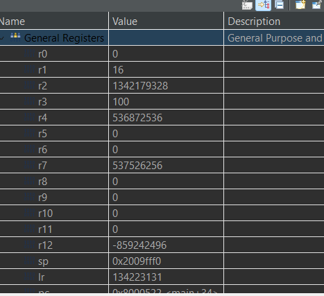

### Memory

To view the memory we can the `Memory Browser` window. This will show us the current value of all memory locations and allows us to search through the memory. To view this window go to `Window` -> `Show View` -> `Memory Browser`.
    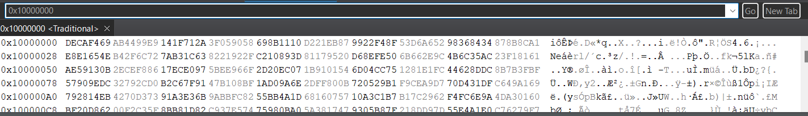

### Disassembly

One useful feature that the debugger provides is the ability to view the disassembled code. This can be a useful tool to see what the compiler is doing with our code. To view this window go to `Window` -> `Show View` -> `Disassembly`.
    <br>
    <br>
    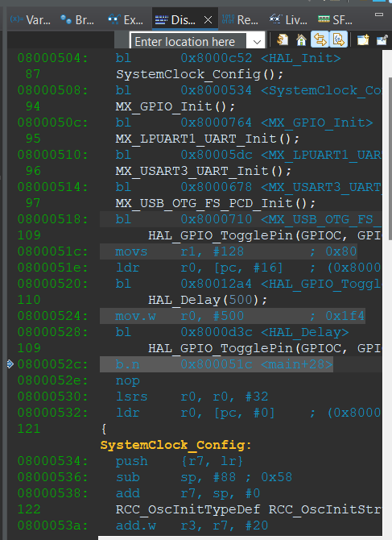

As you step through your C code you will see the corresponding assembly code instruction stepped to as well.


# Opening a Project

To open a project that has already been created you can go to `File` -> `Open Projects from File System`. Yo will see the following window:

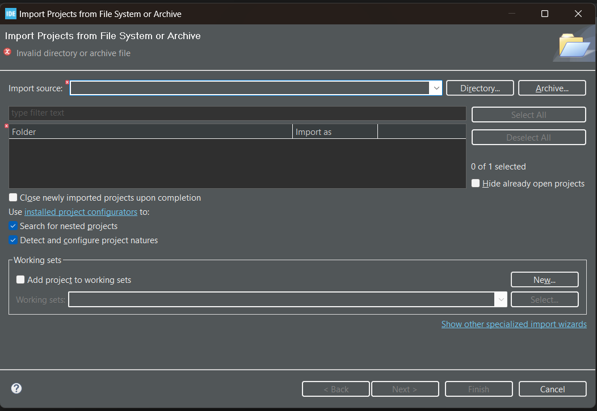

Click `Directory` and navigate to the folder that contains the project. Simply select this folder and then press `Next`. This will import the project into the current workspace and allow you to build and run it as needed.

# Code Examples

There is a number of code examples that can be viewed in the repository. These examples are designed to show you how to use the different features of the board. They can be found [here](./Projects/)

## Example Projects

The list of available examples are:
- [Serial Output](./Projects/SerialOutput/)
- [Serial Input](./Projects/SerialInput/)
- [Assembly](./Projects/Assembly/)